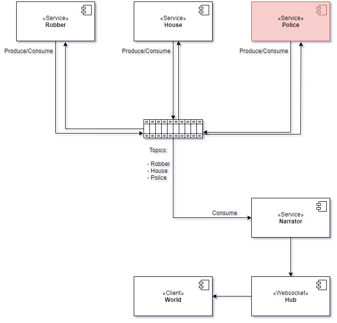

# Domain Events and Event Sourcing implementation in php

## Introduction
The world is in chaos, people can have their houses anytime! The robbers are ruthless, they can rob houses from people and steal their money, increasing their fame, the robbers belong to the underworld. However one can hope, if we have the divine alarms in our houses they can warn people and the police station and send cops to catch these nasty robbers, and after that we can only pray that they succeed.

## Domain:
- House 
  - House
  - Person
  - Alarm
  

- Police
  - PoliceStation
  - Cop | CorruptCop
  

- Robber | Underworld
  - Robber
  - BlackMarket
  - RobberAgency
 

- Journal
  - Journal
  
  
These are the domain artifacts, not all of them are implemented yet.
The idea is that each House, Police, Robber are bounded contexts, and each is in its application.
The project is implemented in memory but design as if they were 3 distinct applications

## Use cases:
  
- House:
    - Create house
    - Notify police station (not implemented)
    
- Police: (not implemented)
    - Intervene (not implemented)
    
- Robber:
    - Create robber
    - Assault house
    
- Journal:
    - Publish assaults based on some algorithm or intelligence (not implemented)
     
    

# Use case: Start Assault

## Choreography
### Version 1
| Step        | Triggering Event | Participant | Action    | PublishedEvents
| ----------- | ---------------- |-----------  |----------- |----------- 
| 1           |-            | RobberService    | startAssault()      | AssaultStartedEvent       |
| 2           | AssaultStartedEvent        | HouseService       | underAssault()       | AssaultSucceededEvent / AssaultFailedEvent|
| 2.1           | AssaultSucceededEvent        | RobberService       | assaultSuccededEvent()       |  -|
| 2.2           | AssaultFailedEvent        | RobberService       | assaultFailedEvent()       |  -|

### Version 2
| Step        | Triggering Event | Participant | Action    | PublishedEvents
| ----------- | ---------------- |-----------  |----------- |----------- 
| 1           |-            | RobberService    | startAssault()      | AssaultStartedEvent       |
| 2           | AssaultStartedEvent        | HouseService       | underAssault()       | AssaultSucceededEvent / AssaultFailedEvent / FireAlarmEvent |
| 2.1           | AssaultSucceededEvent| RobberService       | assaultSuccededEvent()|  -|
| 2.2           | AssaultFailedEvent   | RobberService       | assaultFailedEvent()  |  -|
| 2.3           | FireAlarmEvent       | PoliceService       | intervene()           |  ArrestedEvent / EscapedEvent| 
| 2.3.1         | ArrestedEvent        | RobberService       | arrestedEvent()       |  -| 
| 2.3.2         | EscapedEvent        | RobberService        | escapedEvent()       |  -| 

# Services Interaction Diagram

## Questions
- Event versioning
- Streams per aggregate (?)
- Mark domain events that dont change state (?) Should i apply events to the aggregate that dont change state (?)
- Event scope, difference between global events from local events
- Event de-decoupling is missing
- Project structure requires some work
